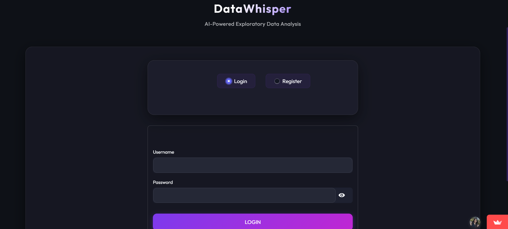
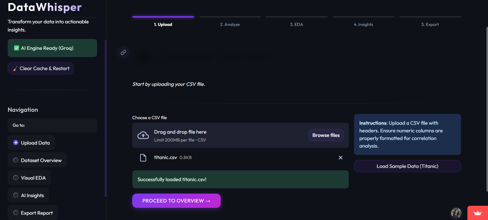
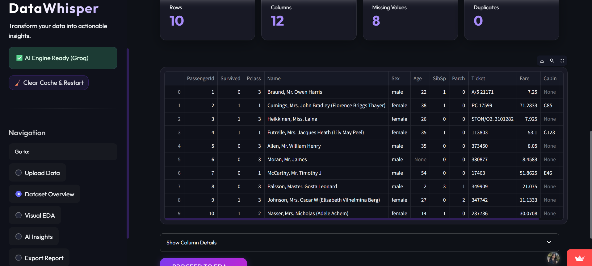
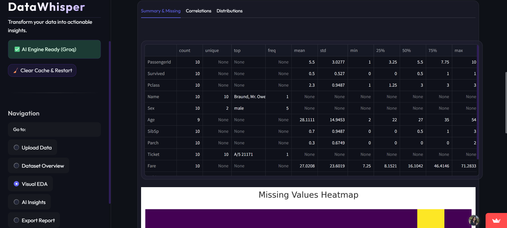
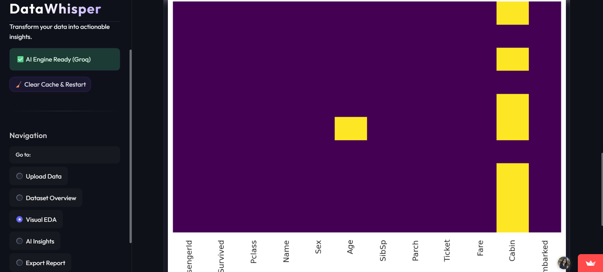
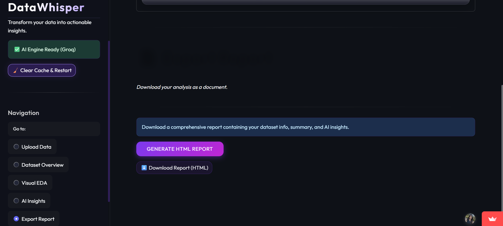

# DataWhisper 📊

### 🔗 Live Demo: https://datawhisper-elnvwkoaq6og6w2kzwid2n.streamlit.app

A full-stack AI-powered web application built with Streamlit that allows users to upload a CSV file and automatically generates insights, visualizations, and an interactive chat interface for data exploration.

---

## Features
- **Exploratory Data Analysis (EDA):** Automatic generation of summary statistics, missing value heatmaps, correlation matrices, and distribution/count plots.
- **AI-Powered Insights:** Get plain-English insights (trends, correlations, anomalies) generated by Groq's LLM.
- **Chat with Data:** An interactive chat interface powered by LangChain's Pandas Dataframe Agent to ask questions directly about your data.
- **Recommendations:** Actionable preprocessing steps (handling missing values, outliers) suggested by AI.
- **Report Export:** Generate and download a comprehensive HTML report containing your visualizations and AI insights.
- **Secure Authentication:** User registration and login with secure password hashing.
- **Robust Validation:** Proper error handling for invalid file uploads, empty datasets, and missing inputs.

## Screenshots

### 1. Login


### 2. Upload Data


### 3. Dataset Overview


### 4. Visual EDA


### 5. Missing Values Heatmap


### 6. Export Report


## Project Structure
```text
├── app.py                     # Main Streamlit application
├── requirements.txt           # Project dependencies
├── README.md                  # Project documentation
├── config.yaml                # Authentication configuration
├── .env.example               # Environment variables template
├── sample_data/
│   └── titanic.csv            # Sample dataset for testing
└── src/
    ├── auth.py                # Authentication (login/register)
    ├── chat.py                # LangChain Pandas Agent integration
    ├── data_loader.py         # CSV file parsing and basic info
    ├── eda.py                 # Matplotlib/Seaborn visualization logic
    ├── llm_insights.py        # LLM integration for dataset insights
    ├── recommendations.py     # LLM integration for data recommendations
    ├── report_generator.py    # HTML report generation logic
    ├── ui_components.py       # Reusable UI components
    └── validators.py          # Request validation utilities
```

## Setup Instructions

### Prerequisites
- Python 3.9 or higher installed ([download from python.org](https://www.python.org/downloads/))
- Git installed ([download from git-scm.com](https://git-scm.com/downloads))
- A Groq API key for AI features (free at [console.groq.com](https://console.groq.com/))

### Step 1: Clone the repository
```bash
git clone https://github.com/Payal-Dhokane/DataWhisper.git
cd DataWhisper
```

### Step 2: Create a virtual environment (recommended)
Using a virtual environment prevents dependency conflicts with other Python projects.

**On Windows:**
```bash
python -m venv venv
venv\Scripts\activate
```

**On macOS/Linux:**
```bash
python3 -m venv venv
source venv/bin/activate
```

You should see `(venv)` appear in your terminal prompt, indicating the virtual environment is active.

### Step 3: Install dependencies
```bash
pip install --upgrade pip
pip install -r requirements.txt
```

If you encounter installation errors, try installing packages one at a time:
```bash
pip install streamlit pandas numpy matplotlib seaborn plotly langchain langchain-core langchain-groq langchain-experimental tabulate PyYAML python-dotenv
```

### Step 4: Set up API keys
Create a `.env` file in the project root directory:
```bash
# .env file
GROQ_API_KEY=your_groq_api_key_here
```

Get your free API key at [console.groq.com](https://console.groq.com/).

### Step 5: Run the application
```bash
streamlit run app.py
```

This will open the app in your default web browser at `http://localhost:8501`.

## Common Errors & Fixes

| Error | Likely Cause | Solution |
|-------|-------------|----------|
| `ModuleNotFoundError: No module named 'streamlit'` | Dependencies not installed | Run `pip install -r requirements.txt` |
| `ImportError: cannot import name '...' from 'langchain'` | LangChain version mismatch | Run `pip install --upgrade langchain langchain-core langchain-experimental` |
| `GROQ_API_KEY not found` | Missing `.env` file or API key | Create a `.env` file with `GROQ_API_KEY=your_key` |
| `Streamlit App - Module Not Found` | Running from wrong directory | Make sure you're in the project root (`cd DataWhisper`) |
| `Permission denied` on venv activation (Windows) | Execution policy restriction | Run PowerShell as Administrator and execute: `Set-ExecutionPolicy -ExecutionPolicy RemoteSigned -Scope CurrentUser` |
| `pip: command not found` | Python/Pip not in PATH | Reinstall Python and check "Add Python to PATH" during installation |
| `Validation Error: No file uploaded` | No CSV file selected | Upload a valid CSV file before proceeding |
| `Validation Error: Invalid file type` | Wrong file format selected | Only CSV files are supported |
| `Validation Error: Empty dataset` | Uploaded CSV has no data | Ensure your CSV contains at least 2 rows |
| `Authentication setup error` | Authenticator version mismatch | Ensure `streamlit-authenticator` is version 0.4+ |

If you're still stuck, please [open an issue](https://github.com/Payal-Dhokane/DataWhisper/issues/new).

## Usage

1. Launch the app with `streamlit run app.py`
2. Upload a CSV file using the file uploader widget
3. Explore the automatically generated visualizations and statistics
4. Use the chat interface to ask questions about your data in plain English
5. Download the HTML report for sharing or documentation

## Sample Data
A sample Titanic dataset is included in the `sample_data/` directory to test the app without your own data.

## Tech Stack
- **Frontend:** Streamlit
- **Data Processing:** Pandas, NumPy
- **Visualization:** Matplotlib, Seaborn, Plotly
- **AI/LLM:** LangChain, Groq (Llama models)
- **Authentication:** Streamlit-Authenticator 0.4+, Streamlit-OAuth
- **Validation:** Custom RequestValidator module